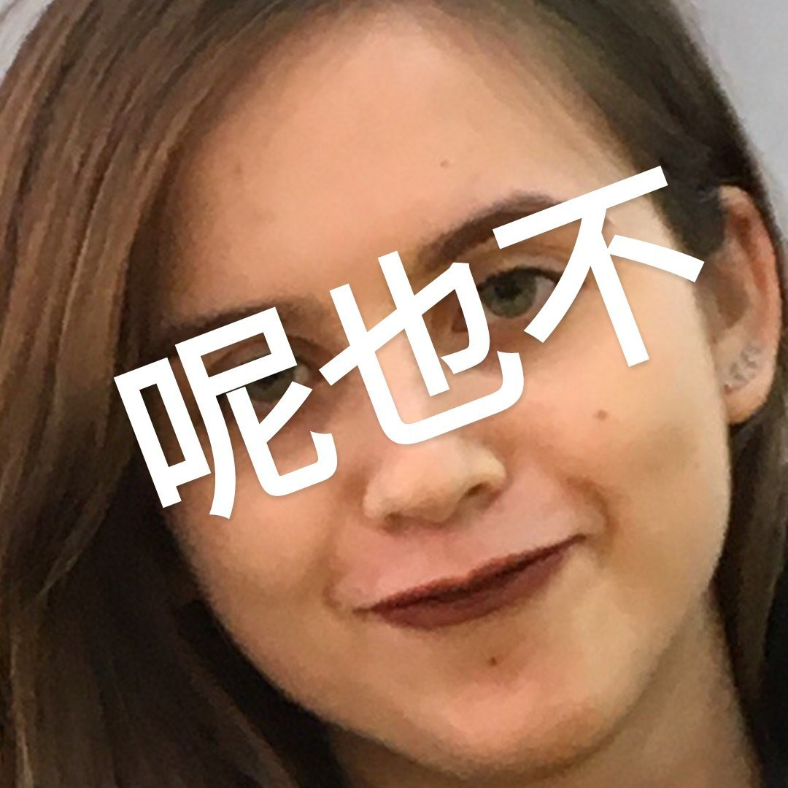

# hw1
# Привет, меня зовут Анютка...
И тут немного неимоверно полезной информации обо мне
***
## Что я говорю о себе при первом знакомстве
Мне 18 годиков, и я уже пять месяцев как живу взрослой жизнью. Мои корни находятся в Татарлэнде, родине КамАЗов и өчпочмаков (подробнее смотри [тут](https://ru.wikipedia.org/wiki/%D0%9D%D0%B0%D0%B1%D0%B5%D1%80%D0%B5%D0%B6%D0%BD%D1%8B%D0%B5_%D0%A7%D0%B5%D0%BB%D0%BD%D1%8B)).
Я живу в общежитии, и это в значительной степени определяет мой образ жизни. Например, я полюбила:
* коричневый цвет (из-за обоев на стенах и потолке); 
* поездки на электричках (особенно утренние, когда всё Подмосковье рвётся в столицу);
* моих замечательных соседок (целых 7 штук, 3 из которых - Насти).
***
## Моя университетская жизнь
### Дженерал овервью
Так сложилась, что из физико-математической колыбели судьба привела меня прямиком в лингвистику. Я не уверена, будет ли у меня после этого рабта, на замужество я совсем не рассчитываю, зато всегда смогу заниматься сложнолингвистическими приколами, например, такими:

### Люди, ради которых я туда хожу
Здесь у меня появились друзья. Раньше у меня, конечно, тоже были друзья, но здесь всё стало иначе. Только посмотрите на этих заек...
